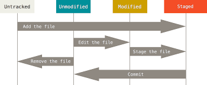

## clase 2
    
    https://github.com/abhisheknaiidu/awesome-github-profile-readme

## Agregar remoto en repositorio local

    git remote add origin <URL>

## Verificar que este configurado el remoto 

    git remote
    git remote -v

## Status de archivos

**UNTRACKED** => Archivos que no se agregaron al index (Staging Area) y por consecuencia no se les hará seguimientos

**STAGED** => Archivos que fueron agregados al area temporal o Staging Area

**UNMODIFIED** => Archivos que se encuentran en el repositorio y que no fueron modificados

**MODIFIED** => Archivos que se encuentran en el repositorio pero difieren con los que se encuetran actualmente en el directorio de trabajo (Working Directory)



# Git amend
Agregar algo que me olvide en el último commit

    git add . o <archivo>
    git commit --amend

# TRABAJAR CON RAMAS

## Creae una rama

    git branch <nombreDeRama>

## Mirar las ramas que tengo en el repositorio

    git branch

## ¿Cómo se en que rama estoy?

en las consolas tipo Linux/unix, voy a tener al costado del path (dev, master, etc).
Otra forma es con *git status*

    git status
    git branch

## Listar ramas remotas

    git branch -r

## Eliminar ramas
```sh
    git branch -d #Borrar la rama si en algun momento fue fusionada (Merge)
```
```sh
    git branch -D #Borra la rama en el caso de que no me deje por que no fue fusionada o mergeada
```
## Subir rama al remoto

    git push -u origin <nombre-rama>

ejemplo:

    git push -u origin dev

## Merge

**IMPORTANTE**: Tengo que estar en la rama que va a recibir los cambios. Por ejemplo:

Si quiero traerme a Master lo que tengo en Develop, tengo que estar en Master.
    
    git merge <Nombre-Rama>